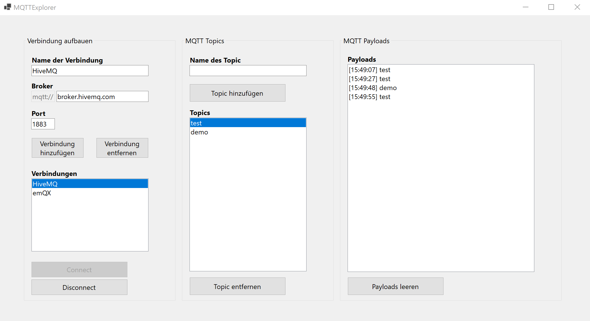

# MQTT Explorer (WinForms)


Ein einfacher, selbstgebauter **MQTT Explorer in C# (WinForms)** zum:
- Verwalten von Verbindungen
- Abonnieren von Topics
- Live-Anzeigen von Payloads
- Speichern von Verbindungen in einer JSON-Datei

Projekt entstand als Lernprojekt.

---

## Features

- Mehrere MQTT-Verbindungen speichern
- Dynamisches Abonnieren & Entfernen von Topics
- Live-Payload-Anzeige in einer ListBox mit JSON-Highlighting
- Automatisches Speichern der Verbindungen in `connections.json`
- Asynchroner MQTT-Connect
- Saubere Trennung von UI, Logik und MQTT

---

## Installation

1. Repository klonen:
   ```git clone https://github.com/TillKloss/MQTTExplorer```
2. Projekt in Visual Studio öffnen.
3. NuGet-Paket installieren:
   MQTTnet
4. Projekt bauen & starten.

Die Datei `connections.json` wird automatisch beim ersten Hinzufügen einer Verbindung erstellt.

JSON-Beispiel: <br>
```json
[
  {
    "Name": "HiveMQ",
    "Broker": "broker.hivemq.com",
    "Port": 1883
  }
]
```
---

## Screenshots

### Hauptansicht


### Payload-Viewer

